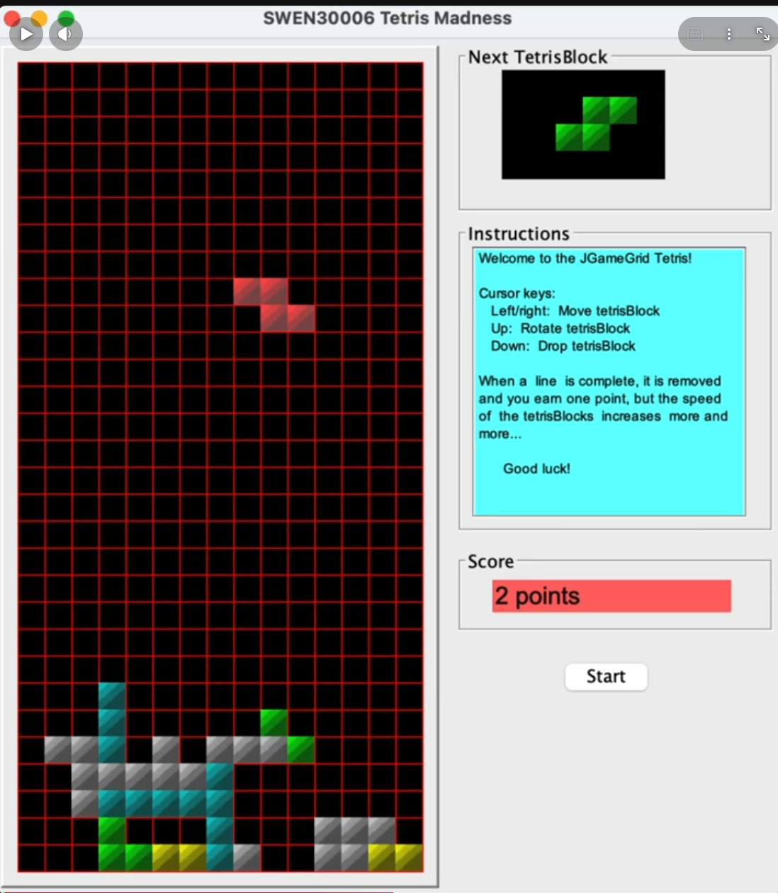

# Tetris Madness

An extended Java implementation of the classic Tetris game, developed with a focus on **Object-Oriented Programming, GRASP principles, and extensible software design**.

## Features

* Classic Tetris gameplay with 7 standard pieces
* 3 new Madness pieces: Cross, Plus, and Slash
* Randomised piece spawning and falling speeds
* Score and game statistics tracking
* Configurable gameplay through properties files
* Preserves original Tetris behaviour when Madness features are disabled

## OOP & Design

The project applies key **OOP and GRASP principles**, including:

* **Encapsulation** — game state and piece behaviour are managed within appropriate classes.
* **Polymorphism** — different Tetris pieces can provide different behaviours, such as rotation.
* **Information Expert** — responsibilities are assigned to classes that have the information needed to perform them.
* **High Cohesion & Low Coupling** — gameplay, pieces, configuration, and statistics are separated to make the system easier to maintain.
* **Controller** — game flow is coordinated without placing all responsibilities into a single class.

The design uses abstraction and polymorphism to make adding future Tetris pieces and gameplay variations easier without heavily modifying existing game logic.

## Tech Stack

**Java · Gradle · JGameGrid · Object-Oriented Design**

## Links

🎥 **Gameplay Demo:**
https://youtube.com/shorts/ZX70EQtXg0c
